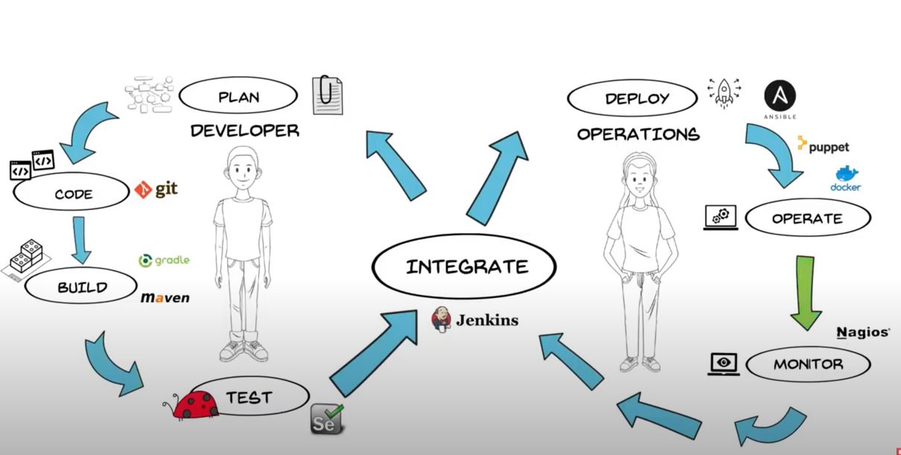

Jenkins (CI tool)
------------------------------------------------------------------------------------

sudo wget -O /etc/yum.repos.d/jenkins.repo https://pkg.jenkins.io/redhat-stable/jenkins.repo
sudo rpm --import https://pkg.jenkins.io/redhat-stable/jenkins.io.key             ## If you've previously imported the key from Jenkins, the rpm --import will fail because you already have a key. Please ignore that and move on.

yum install jenkins
  
 /etc/systemcingig/jenkins     ## change the poort number

To change the admin password 
 /var/lib/jenkins/config.xml
          - Change <useSecurity>true</useSecurity> to false
          - Restart Jenkins: sudo service jenkins restart
 
