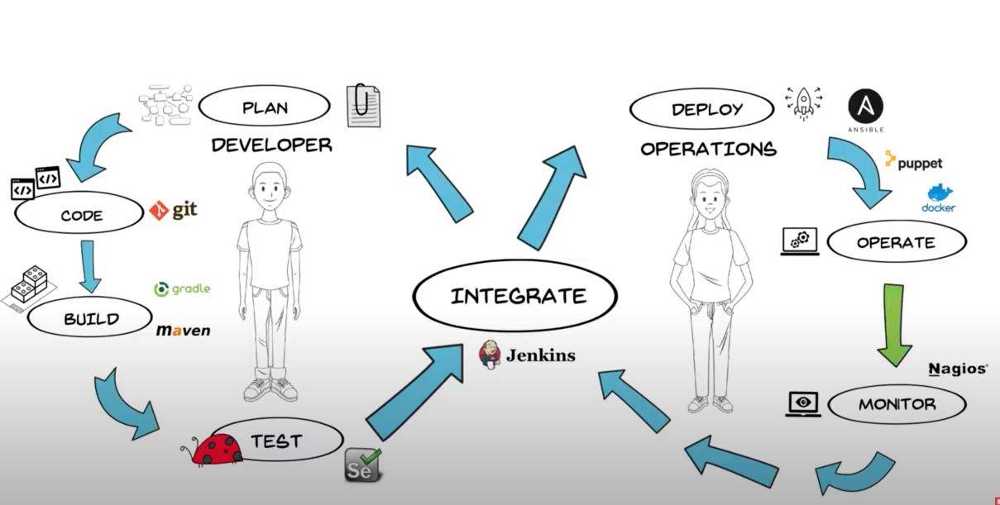

Jenkins (CI tool)
------------------------------------------------------------------------------------



## Install Jenkins
---

```bash
sudo wget -O /etc/yum.repos.d/jenkins.repo https://pkg.jenkins.io/redhat-stable/jenkins.repo
sudo rpm --import https://pkg.jenkins.io/redhat-stable/jenkins.io.key             ## If you've previously imported the key from Jenkins, the rpm --import will fail because you already have a key. Please ignore that and move on.

yum install jenkins
```  
### change the port number 
     /etc/systemcingig/jenkins     ## change the poort number
 
### To change the admin password 
      /var/lib/jenkins/config.xml
             - Change <useSecurity>true</useSecurity> to false
             - Restart Jenkins: sudo service jenkins restart

 
 ### Give R/w permissions to your Jenkins user

    chmod 0755 /home/qaserver3/
    chmod -R 0755 /home/qaserver3/app/maven-2.2.1
    Make ensure Jenkins can access all the files

    sudo -iu jenkins  
    Run:

    /home/qaserver3/app/maven-2.2.1/bin/mvn -v


## Install JDK 8
---
```bash
wget --no-check-certificate --no-cookies --header "Cookie: oraclelicense=accept-securebackup-cookie" http://download.oracle.com/otn-pub/java/jdk/8u141-b15/336fa29ff2bb4ef291e347e091f7f4a7/jdk-8u141-linux-x64.rpm

sudo yum install -y jdk-8u141-linux-x64.rpm

java -version

/usr/java/jdk1.8.0_141/
````
