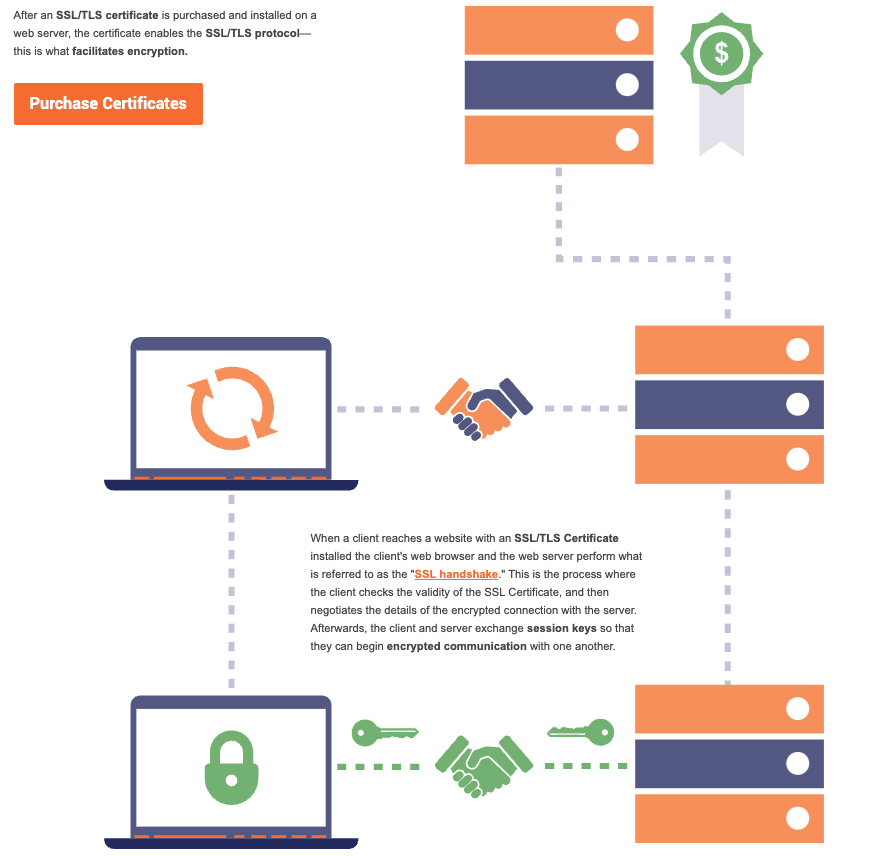

### Encryption:
Encryption is the process of converting plaintext data into an unreadable format (ciphertext) to protect it from unauthorized access. Decryption is the reverse process, converting ciphertext back into plaintext. Encryption algorithms can be classified into two categories:

**Symmetric encryption:** The same key is used for both encryption and decryption. Examples of symmetric algorithms include AES, DES, and 3DES.
**Asymmetric encryption**: Different keys are used for encryption and decryption, known as a public and private key pair. Examples of asymmetric algorithms include RSA, ECC, and ElGamal.

**Whta is PKI**
It's a two key Asymmetric-cryptography system, it's a framework that will help IP systems have a high level information confidentialities true, strong data encryption, which provides high level of confidence, through digital signatures, and digital certificates.

It's a 2 key for security system which involves in:
 - Private key 
 - Public key 

public keys are used to encrypt a file and private Keith are used to decrypt files. or vice versa
So if you want to send a secure message, all you have to do is use the public key to encrypt it and send it to the person who has the private key so that they can decrypt and read the message, or vice versa this is what PKI does. 

But now the problem is how do you know the public key is a valid public key meaning - how do you know that you are getting the right persons's public key. That is where CERT comes. CERTS are digital signed digital certificate given to the user with the data of "who is the user" , "what is public key" and "whoes it belongs to". 

** who issues the certificates?**

CA does - they are certificate authority, backed up by government to issue certificate:
**What is a certificate authority (CA)?**

A certificate authority (CA) is a trusted entity that issues Secure Sockets Layer (SSL) certificates. These digital certificates are data files used to cryptographically link an entity with a public key. Web browsers use them to authenticate content sent from web servers, ensuring trust in content delivered online.

**The 3 types of digital signatures**

- Level 1 -  
- Level 2 - confidential information, lake, Texas, and confidential documents
- Level 3 - confidential information, like court notices and other legal documents

It’s a system of processes, policies, authentication, and technologies that govern encryption and is ultimately what protects our text messages, emails, passwords, credit card information, and cute cat photos…

**What Is a PKI Certificate?**

**SSL/TLS Certificates**

SSL/TLS certificates are useful for securing data transmission between a website’s server and users’ browsers. Website owner buys and installs SSL certs on the server where the website is hosted. These certificates vary in terms of:

- validation — domain validation (DV), organization validation (OV), and extended validation (EV)
- functionality (what they cover or secure) — single domains, multi domains, single-level subdomains (wildcards), and multiple sites and subdomains (multi domain wildcards).

**Website Security (HTTPS/SSL)**
The most popular use of PKI is in providing secure, encrypted communication between web browsers (clients) and web servers (websites). This is done by employing the HTTPS protocol, which is implemented by installing an SSL certificate on the web server.

The SSL certificate works as the identity card of the website through which browsers can verify that they’re communicating with the right website. When you purchase an SSL certificate, you get the public and private keys. The private key is stored secretly on the web server, and the server uses it to prove its legitimacy.

Through its use of PKI, an SSL certificate:

- Protects the integrity of the message,
- Protects the information from man-in-the-middle attacks, and
- Authenticates both the communicating parties (browser and server).

Such a three-pronged approach to security is vital when you send critical information such as passwords, credit card information, private messages, etc. That’s why it wouldn’t be an exaggeration to call PKI “the bedrock of web security.”

**Personal Authentication Certificates**

Personal authentication certificates, also known as email signing certificates and S/MIME certificates, are useful for securing email communications by inserting digital signatures and using hashing functionality. They also can be used for the client (i.e. recipient) authentication.

**Code Signing Certificates**

Code signing certificates are perfect for protecting downloadable software, drivers, and executables. Software developers and publishers use them. These certificates are available in organizational (OV) or individual validation (IV) format, as well as extended validation and help software developers avoid the security warnings.

**Document Signing Certificates**

Document signing certificates are useful for securing documents shared over the internet by inserting digital signatures and using hashing functionality.

We’ll talk more later about each of these types of certificates and their individual uses. In the meantime, let’s understand where PKI certificate keys come into play.

**What is an SSL/TLS Certificate?**

Think of an SSL/TLS certificate as a driver’s license of sorts—it serves two functions. It grants permissions to use encrypted communication via Public Key Infrastructure, and also authenticates the identity of the certificate’s holder.

SSL Certificates facilitate an encrypted connection between a browser and a web server while also authenticating the identity of the website that owns the cert. With an SSL/TLS certificate, it's important to remember that the end user is the one visiting the website, but they are not the one who owns the certificate itself–that belongs to the company operating the website.

There are three kinds of certificates, DV, OV and EV. They offer varying levels of authentication but the same form of industry-standard encryption. The key to selecting the right SSL/TLS certificate is deciding what level of authentication you need. Smaller websites that do not collect user information may be better off saving money on a DV certificate. Business websites and E-Commerce sites should spring for an OV or EV certificate depending on their size and need for authentication.

**What is TLS**
TLS is based on SSL and was developed as a replacement in response to known vulnerabilities in SSLv3.

SSL is the term commonly used, and today usually refers to TLS.

**Digital Certificate Types**
If you are trying to purchase a certificate for a website or to use for encrypting MQTT you will encounter two main types:

Domain Validated Certificates (DVC)
Extended validation Certificates (EVC)
The difference in the two types is the degree of trust in the certificate which comes with more rigorous validation.

**A domain-validated certificate (DV)** is an X.509 digital certificate typically used for Transport Layer Security (TLS) where the identity of the applicant has been validated by proving some control over a DNS domain

**An Extended Validation Certificate (EV)** is a certificate used for HTTPS websites and software that proves the legal entity controlling the website or software package. Obtaining an EV certificate requires verification of the requesting entity’s identity by a certificate authority (CA).

**What is a certificate fingerprint?**
It is a hash of the actual certificate, and can be used to verify the certificate without the need to have the CA certificate installed.

This is very useful in small devices that don’t have a lot of memory to store CA files.

It is also used when manually verifying a  certificate.

